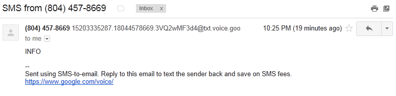

I have been look for a **free SMS API** since April, when my previous free SMS provider, [IMified](http://bot.im), announced its shutdown.

[Zeep Mobile](http://www.zeepmobile.com) claims to be free forever (because it is ad-supported), but my sign-up is unanswered after a few weeks.
[Twilio](http://www.twilio.com/sms) and [Tropo](https://www.tropo.com/) both give developers some free credit, but they charge money for production use.
Other resources are suggesting an in-house solution: buy a SIM card with cheap / unlimited text plan, plug it into a old phone, and connect to the server; this still costs money, and is impossible for those using a VPS.

As a Google Voice user, I'm thinking: **can I use Google Voice to build a free SMS robot**?

## Google Voice API

Google, the company who release an API for almost every product, does not provide a Google Voice API.

The lack of *official* Google Voice API cannot stop passionate developers from automating Google Voice. There are plenty of third-party Google Voice libraries available. The implemented features typically include:

* Sending an SMS message. This can directly be used for the free SMS robot.
* Reading the Inbox.
* Placing a phone call, by calling a forwarding phone and connecting to the callee.

These libraries are implemented by either consuming the XML feed of Google Voice desktop website, or parsing the HTML pages of Google Voice mobile website. They have the following limitations:

* Receiving SMS relies on polling the Inbox. There is no way to receive SMS messages in realtime.
* Placing and receiving phone calls require a forwarding phone, thus cannot be fully automated.

A good SMS robot needs to **receive SMS messages in realtime**. Polling the Inbox not only costs a lot of system resource, but also causes significant delay because you cannot poll the XML feed very often or there is a risk to be blocked off. We need another method to receive SMS.

## SMS-to-email

Looking at Google Voice Settings, an option on Voicemail & Text tab comes to my eye: **Forward text messages to my email**.
After checking this options, every SMS message received on this Google Voice number is delivered to the Gmail Inbox. 

The problem of receiving SMS messages in realtime just becomes a problem of **receiving Gmail emails in realtime**. This shall be easier, because Gmail, as a email service, is more open than Google Voice.

IMAP4, a popular protocol for email retrieval, is supported by Gmail. IMAP4 client can be notified of the arrival of new email through *in-band signaling*. This is a possible solution to receive emails in realtime.

But it is not a good solution: implementing a IMAP4 client is a hard task. Maintaining a IMAP connection requires a long-lived process on the server, so additional work is needed to start that process, monitor its operations, and restart when it dies.

The most familiar programming model to web developers shall be the request-response model.
When I was using IMified, I can receive an SMS message as an HTTP request, and the response body I generate is sent as SMS replies.
Can we achieve this with Google Voice & Gmail?

## Google App Engine Inbound Mail

To **receive SMS messages as HTTP requests in realtime**, we need a third Google product: Google App Engine.
GAE is capable of [receiving email](https://developers.google.com/appengine/docs/java/mail/receiving). When inbound mail is enabled, the app can receive emails sent to *\*@appid.appspotmail.com* as HTTP requests.

In Gmail, set up a filter:  
  
This filter forwards SMS-generated emails to an email address corresponding to an GAE application.

Before you can create this filter, Gmail will ask you to confirm the ownership of the forwarding address by entering a confirmation code. During this step, the GAE application should write the confirmation email to the debug log, so that the developer can find out the confirmation code on Google App Engine console.

After the filter is created, the GAE application can be updated to include the logic of processing the incoming SMS. The sender's phone number can be extracted from email subject; the SMS text is in the body, but the tag lines such as "Sent using SMS-to-email" should be stripped.

## How to Respond?

As suggested in the tag line, "Reply to this email to text the sender back", the application can reply to an SMS by replying to the email.
This method shall be reliable, but Google App Engine's free quota of Mail API Calls is 100 per day, which is quite restrictive.

An alternative method is to use a third-party library.
This is basically a URL Fetch operation, that has much higher quota.

However, no matter which method you use to send SMS responses, Google Voice has a limit of outgoing SMS messages. The quota is said to be about 200 per day. So, a free SMS robot built with Google Voice can only be used for low traffic application.

**UPDATE 2013-12-22**
[Jefferson Kim](http://jeffersonkim.com/) reports that Google Voice does not recognize emails sent from App Engine.
I also find that the third-party PHP library cannot authenticate into Google Voice due to the recent addition of "botguard" script on Google Accounts sign in page.
One possible method of responding is to access Gmail through OAuth with a suitable library, and send replies from Gmail account. I haven't tried this yet.

## Summary

By connecting three Google products together, we are able to build a free SMS robot for low traffic application.

* Incoming SMS message first arrives at Google Voice. It is then delivered to Gmail, and forwarded to Google App Engine as an HTTP request. All of these happens in realtime without polling.
* The application responds by outgoing SMS with a third-party Google Voice library.

